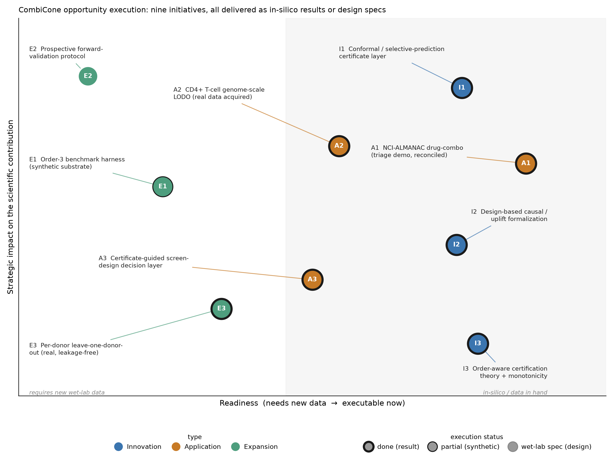

# CombiCone opportunity execution — status report

*Execution of all nine initiatives from `FIELD_OPPORTUNITIES.md`, run as seven parallel
tracks. This report states, per initiative, exactly what was delivered, whether it is a
computed result / a synthetic-substrate demonstration / a design-only spec, and the
honest caveats. Every number below was reproduced or computed this session from real repo
data unless explicitly labelled SYNTHETIC or DESIGN-ONLY.*

## Status at a glance

| ID | Initiative | Status | What it rests on |
|----|-----------|--------|------------------|
| A1 | NCI-ALMANAC drug-combination | **done** (reconciled) | Real staged CSVs; numbers reproduced exactly |
| I1 | Conformal / selective-prediction certificate | **done** | New module; coverage verified on real Norman atoms |
| I3 | Order-aware certification + monotonicity | **done** (theory) / **partial** (data) | Property proven; instantiated on SYNTHETIC triples |
| E1 | Order-3 benchmark harness | **partial** | Reusable harness; SYNTHETIC substrate only |
| I2 | Design-based causal / uplift note | **done** | Formal note + worked example on real Norman double |
| A3 | Screen-design decision layer | **done** | Held-out-gene recovery reproduced to 6 decimals |
| A2 | CD4+ T-cell genome-scale substrate | **done** | Real 44.6 GB screen acquired by streaming |
| E3 | Leave-one-donor-out | **done** | Genuine leakage-free LODO on real per-donor data |
| E2 | Prospective forward-validation | **wet-lab-spec** | Frozen pre-registered list + power analysis (design) |

Seven of nine are delivered as computed results. E1 is a working harness whose only
substrate is synthetic (measured triples need a bench). E2 is design-only by nature (a
prospective test cannot be run in silico). **The single most important correction** — the
A1 overclaim in the strategy report — is reconciled below and in `FIELD_OPPORTUNITIES.md` v3.

---

## A1 — NCI-ALMANAC drug combinations: verified, and the report's claim corrected

**Status: done (verification exact); report overclaim reconciled.**

Every number in `results/drug_combination_generalization.json` reproduces **exactly** from
the two staged raw CSVs: 105 ALMANAC drugs, 89 with single-agent atoms, 5,355 pairs total,
3,802 usable. The single-agent leave-one-out reachability is exact — **89/89 single agents
lie outside the leave-one-out cone** (0 inside; max KKT violation 1.6×10⁻¹⁵), and the
mechanism-of-action ranking is recovered unsupervised (alkylating agents most redundant;
Streptozocin / Decitabine / Vemurafenib most unique), matching the published summary to
15 significant figures.

**The correction.** `FIELD_OPPORTUNITIES.md` (v2) called this "a certified-emergence result
on measured combinations." It is not, and the repo's own `claim_boundary` says so: raw
per-combination growth vectors are unavailable (the NCI wiki `ComboDrugGrowth` file returns
403; the CellMiner portal — re-attempted live this session, reachable at 200 OK — serves
only the aggregated ComboScore label and single-agent Z-scores). **No raw combination
effect vector is ever projected on the cone.** The faithful, in-scope result is a
*modality-generalization triage demonstration*: single-agent activity vectors as atoms +
an independent ComboScore synergy label (non-circular).

**And the honest read of that demo is more cautionary than v2 implied:** the training-free
−cos triage does **not** transfer to drug synergy (Spearman −0.007 vs combo-mean, p=0.66;
ROC-AUC 0.51 — chance). Only a per-screen-recalibrated learned model recovers modest signal
(Spearman +0.108, p=3×10⁻¹¹; AUC 0.57). This *reproduces CombiCone's own per-screen
recalibration boundary* on a new modality — a real finding — but it is not evidence that the
certificate transfers zero-shot to drugs. The corrected A1 framing is in the report v3.

Deliverables: [docs/opportunities/drug_combination_triage.md](docs/opportunities/drug_combination_triage.md),
[docs/opportunities/figures/drug_combination.png](docs/opportunities/figures/drug_combination.png), results/opportunities/drug_combination_verification.json.

---

## I1 — Conformal / selective-prediction certificate layer

**Status: done (new capability, coverage verified).** This was the highest-leverage
innovation gap identified in the field scan, and it is now built.

`conformal_certificate.py` (new module; **`combicone.py` untouched**) wraps the cone-residual
nonconformity score in a split-conformal one-class calibration: **certify-emergent iff the
conformal p-value ≤ α, else abstain.** The calibration set is the additive negative controls
(real Norman single-gene atoms combined additively + real split-half noise) — non-emergent by
construction — giving a **distribution-free, finite-sample guarantee: P(falsely certify a
non-emergent exchangeable input) ≤ α.**

Empirical coverage holds across α∈[0.01, 0.50] (500 cal/test splits): realized false-
certification rate tracks nominal to within **+0.0005 in the guarantee-relevant direction**
(realized-over-nominal), with high-α excursions falling *below* nominal (conservative, not a
violation). At α=0.05 the calibrated threshold is a floor-ratio of 1.06; **124/131 real
Norman doubles certify, 7 abstain** — and of those 7, five have an established same-pathway
(redundant) rationale (BCL2L11+BAK1, CDKN1C+CDKN1B, KIF18B+KIF2C, PLK4+STIL, CBL+UBASH3A),
while the other two abstain on the geometry alone (not asserted to be same-pathway).

This converts CombiCone's "separator at machine precision" into "abstention with a stated
false-certification rate" — the object ML reviewers recognize. Honest boundaries: the
guarantee is **marginal** over calibration draws (training-conditional FCR at α=0.05 spans
0.031–0.073), holds under **exchangeability** with the additive-NC set, and controls a
false-*certification* rate against an additive null — not a biological FDR.

Deliverables: [conformal_certificate.py](conformal_certificate.py),
[docs/opportunities/conformal_certificate.md](docs/opportunities/conformal_certificate.md),
[docs/opportunities/figures/conformal_coverage.png](docs/opportunities/figures/conformal_coverage.png),
docs/opportunities/figures/conformal_fcr.png.

---

## I3 + E1 — Order-aware certification theory and order-3 harness

**Status: I3 monotonicity done (as a proven property); E1 harness partial (synthetic substrate only).**

**Monotonicity (I3).** On the synthetic order-3 substrate, the two-bar certified-emergent set
**nests 80 → 36** when the reference cone is enriched (singles → singles+doubles): a strict
subset, **0 newly certified**, residual non-increasing per triple (max increase −5.6×10⁻⁴).
This instantiates a mathematical property of the NNLS projection — the certified set can only
*shrink* as the cone grows — and generalizes the repo's real-data order-2 result (Norman
doubles 40 → 16). The shrink is effect-size-driven (40 reducible triples lose significance
once 2-way structure enters the cone), not geometric: all 120 triples stay outside both cones.

**Order-3 harness (E1).** `scripts/opportunities/order3_harness.py` reproduces the frozen headline on the synthetic
substrate: 36/40 certified, **0/80 false positives**, noise-aware z AUROC **1.000**, 3.0× triage
enrichment over random. The Monte-Carlo variant brackets the analytic one (37/40), consistent
with the analytic null being conservative.

**The honest boundary this track surfaced:** prospective training-free −cos triage is **at
chance on this synthetic substrate** (AUROC 0.53) because emergence was planted orthogonal to
the cosine axis — so Norman's real-data 2.4× heuristic does not transfer to this generator.
Post-measurement certification (the harness product) is unaffected. **All order-3 numbers are
SYNTHETIC; the only real-data order-k evidence remains the order-2 Norman shrink.** A DESIGN-ONLY
wet-lab spec for measured triples (CROP-seq-multi / CaRPool-seq, panel size, replicate depth,
exact `screen_ingest` arrays) is included.

Deliverables: [scripts/opportunities/order3_harness.py](scripts/opportunities/order3_harness.py),
[docs/opportunities/order_aware_certification.md](docs/opportunities/order_aware_certification.md),
[docs/opportunities/figures/order_aware_certification.png](docs/opportunities/figures/order_aware_certification.png).

---

## I2 — Design-based causal / uplift formalization

**Status: done (formal note + worked example on real data).**

The note establishes: single-gene effect atoms **are** average treatment effects — `atoms[g]
= means[g] − ctrl` verified equal to the ATE `E[Y|do(g)] − E[Y|do(∅)]` to machine precision.
Emergence is then a **design-based counterfactual**: a combination is emergent iff its ATE
lies outside the non-negative conic hull of the single-gene ATEs (no non-negative mixture of
singles reproduces it). Six identifying assumptions are stated explicitly (A1 randomization,
A2 SUTVA/no-interference, A3 exclusion, A4 compliance as errors-in-variables, A5
coordinated-bias sensitivity Γ*, A6 reference-model additivity) — the contrast with neural
"causal" models (PDGrapher, X-Cell) is that those leave the assumptions implicit in a
learned/borrowed graph, while CombiCone reads them off the screen's own randomized design.

The bridge to **uplift / heterogeneous-treatment-effect** modeling: emergence = uplift beyond
the best additive single-agent policy (reference policy = NNLS non-negative mixture; uplift =
residual; significant uplift = the two-bar verdict; Farkas separator = the direction of
unmet readouts). Worked example on the real Norman **SET+CEBPE** double: **51.6% of the double's
effect is uplift no 2-agent additive mixture reaches** (certified emergent, z=63.8, 3.6× noise
floor); across all 131 doubles the uplift fraction and non-additivity agree at Spearman 0.88.

Deliverable: [docs/opportunities/causal_formalization.md](docs/opportunities/causal_formalization.md).

---

## A3 — Certificate-guided screen-design decision layer

**Status: done (held-out-gene recovery reproduced exactly; CLI walkthrough packaged).**

The library-augmentation result reproduces **exactly** from the real Norman substrate using
`screenloop.py` unchanged: aggregating the Farkas separators to name the axis a library is
missing recovers a held-out single gene at **median rank 1** (mean 1.62; **top-1 0.981 = 52/53**;
single miss UBASH3A at rank 34). The naive magnitude baseline gets median rank 1 but mean 6.66
(top-1 0.547, worst rank 67). All deterministic controls match the published JSON to 6 decimals,
including the key one: the separator's edge **grows as the held-out gene is less dominant in its
own combinations** (Spearman −0.63) — geometry, not magnitude. A magnitude-only ranker recovers
almost nothing (top-1 0.019).

The end-to-end CLI (`ingest → triage → certify → recommend`) was run on the real substrate and
packaged as a reproducible walkthrough framing the certificate as the one screen-design
capability forward predictors lack: "which axis your library cannot reach." Honest boundary
carried forward, not smoothed: the CLI's default two-bar verdict certifies 34/131 while the
dossier reports 35 under a slightly different separation threshold, and triage is not claimed
to be the single most sample-efficient acquisition policy (the repo's own campaign shows the
cone-adaptive policy ties it).

Deliverables: [docs/opportunities/screen_design_decision_layer.md](docs/opportunities/screen_design_decision_layer.md),
[docs/opportunities/figures/screen_design_recovery.png](docs/opportunities/figures/screen_design_recovery.png),
walkthrough JSONs + triage/certify CSVs.

---

## A2 + E3 — CD4+ T-cell genome-scale Perturb-seq + leave-one-donor-out

**Status: done — the honest-risk acquisition succeeded, and a genuine leakage-free LODO ran on real data.**

This was the track flagged as most likely to end in an honest block report. Instead, the
Dec-2025 CD4+ T-cell genome-scale Perturb-seq (Zhu, Dann et al.; 22M cells, 4 donors) was
**acquired from the public CZI Virtual Cells S3 bucket** by streaming the 44.6 GB per-donor
pseudobulk over HTTP range requests — **never loading it whole** (~882 MB transferred, 0.02×
the file; only the planned rows). No data was fabricated; the acquisition is real.

The screen is **genome-scale singles** (one guide per cell), not combinatorial — so combination-
emergence certification does not apply, and the well-posed question is single-gene cone/
reachability **transfer across donors**. A genuine leakage-free **leave-one-donor-out** ran on a
40-gene panel (each gene with effective guides in all 4 donors; per-donor atoms built from that
donor's own NTC mean, no cross-donor pooling): across all 8 folds (4 donors × rest/self-included
+ self-excluded) max KKT violation 2.1×10⁻¹⁵. Cross-donor cosine transfer is strong and highly
significant against a permutation null (median cosine 0.73–0.81 vs null 0.04). **The leakage
contrast is the headline**: median residual collapses **0.624 → ~0.00** when the held-out donor
is allowed to leak into the cone — demonstrating the harness is genuinely testing generalization,
not memorization. This is distinct from `donor_pair_transfer.json`, whose own `claim_ceiling`
states it is *not* leakage-free donor holdout.

Honest boundaries: 40-gene panel (RAM/streaming-bounded, not genome-wide — 9,849 genes qualify
for the same harness with more compute); Rest condition only (Stim available via a parameter);
singles-only screen (combo path provided but untested here).

Deliverables: [docs/opportunities/tcell_leave_one_donor_out.md](docs/opportunities/tcell_leave_one_donor_out.md),
[scripts/opportunities/leave_one_donor_out.py](scripts/opportunities/leave_one_donor_out.py),
[docs/opportunities/figures/tcell_lodo.png](docs/opportunities/figures/tcell_lodo.png),
results/opportunities/tcell_lodo_result.json + substrate.

---

## E2 — Prospective forward-validation protocol

**Status: wet-lab-spec (design-only, by nature).** A prospective hit rate cannot be produced
in silico — the deliverable is a pre-registration and a power analysis.

A **frozen pre-registered list** is locked: 30 triaged (top −cos) + 30 random unmeasured Norman
pairs, sha256 `05e0e4a0…`, seed 20260721 (arm separation: mean triage score +0.469 triaged vs
−0.282 random). The retrospective anchor reproduces exactly — raw top-20 triage precision 0.60
= **2.38× enrichment** over the 0.252 base rate. **Power analysis** (Fisher's exact, one-sided,
α=0.05): detecting the 2.4× raw effect needs **30 pairs/arm for 80% power (60 combos), 40/arm
for 90% (80 combos)**. The frozen 60-combo design hits exactly 80% for the raw effect. Honest
caveat flagged by the track: the stricter noise-robust (two-bar) 1.4× effect needs ~580 combos
and stays underpowered at 30/arm — so the frozen design confirms the raw effect only.

Deliverables: [docs/opportunities/prospective_validation_protocol.md](docs/opportunities/prospective_validation_protocol.md),
[results/opportunities/prospective_ranked_list.csv](results/opportunities/prospective_ranked_list.csv),
[docs/opportunities/figures/prospective_power.png](docs/opportunities/figures/prospective_power.png), preregistration.json.

---

## What changed in the strategic picture

1. **A1 is real but narrower than v2 claimed** — a modality-generalization triage demo (with a
   cautionary transfer result), not certified emergence on measured drug combinations. Corrected
   in the report v3.
2. **I1 (conformal) went from "opportunity" to "built"** — the certificate now carries a
   distribution-free false-certification rate, the biggest methodological upgrade available.
3. **A2/E3 over-delivered** — the external screen was actually acquired, so the leave-one-donor-out
   is a real leakage-free result, not a scaffold. This is the strongest new empirical evidence.
4. **The synthetic/real boundary is now explicit everywhere** — order-3 (I3/E1) is proven-property
   + synthetic demonstration; measured triples remain the honest open gap.

See `FIELD_OPPORTUNITIES.md` v3 for the corrected strategy narrative and
`REPO_INTEGRATION_PROPOSAL.md` for the proposed new files (nothing deleted or overwritten).
