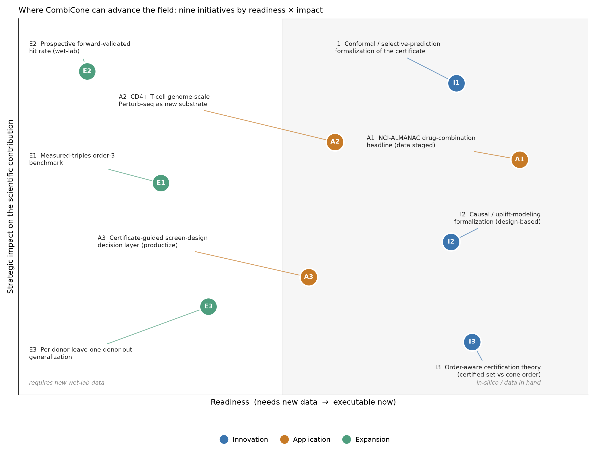

# What science needs next — and where CombiCone can supply it

*A field-grounded assessment of expansion, application, and innovation directions for the
`cell-state-reachability` / **CombiCone** repository.*

> **v3 — executed.** All nine initiatives in this note were subsequently executed in
> parallel. Per-initiative results, status (done / partial / wet-lab-spec), and honest
> caveats are in **`EXECUTION_REPORT.md`**; each section below carries an inline **Status**
> line. The most important change from v2: the **A1 drug-combination claim is reconciled**
> to the repo's own `claim_boundary` (it is a modality-generalization *triage* demo, not
> certified emergence on measured combinations — §4-A1).

**Scope of this document.** This is an *external* strategy note. The repo's own
`limitations_and_reinforcement_plan.tex`, `SCIENTIFIC_VALIDATION_PLAN.md`, and
`FINDINGS.md` already contain an unusually rigorous internal self-critique (limitations
L1–L8, wet-lab specs W1–W3, a causal-validation dossier). I did **not** re-derive that
work. Instead I read the current (2025–2026) literature to answer a different question:
*given where the field is actually moving, which of the repo's open directions are the
ones that matter, and what is the field missing that this method — uniquely — can supply?*
Every external claim below is tied to a paper I retrieved and verified (DOI in the
reference list); numbers about the repo itself are from its own frozen findings.

---

## 1. The one-sentence reading of the field

The perturbation-modeling field spent 2023–2024 building ever-larger forward predictors
(single-cell foundation models, virtual-cell models) and spent 2025–2026 discovering, in
public and still-unresolved argument, that **prediction accuracy is a treacherous axis to
compete on.** A method that returns a *checkable feasibility verdict with a certificate*
instead of a point prediction is not a marginal variant of the mainstream — it is the
thing the mainstream's own crisis is asking for. CombiCone is already that method. Its
opportunity is therefore less "add capability" than "**plant the flag while the debate is
hot, and extend the certificate into the three places the field has left open**":
higher-order interactions, non-transcriptomic modalities (drugs), and principled
abstention.

---

## 2. What the field is arguing about right now (and why it helps this repo)

The repo's central positioning claim — *the accuracy race is the wrong race* — is not a
lone contrarian take. It is a live, high-traffic debate, and the debate is **unresolved**,
which is the best possible environment for a method that sidesteps it.

- The Nature Methods benchmark that the repo already cites — deep-learning perturbation
  predictors *do not yet beat simple linear baselines* — accumulated **~104 citations in
  roughly its first year**, an unusually fast uptake that signals a field in active
  self-doubt. (Ahlmann-Eltze et al., *Nat Methods* 2025.)
- The critique is **not settled**. An October 2025 rebuttal argues the failure is an
  artifact of *benchmarking metrics*, not the models ("Deep Learning-Based Genetic
  Perturbation Models *Do* Outperform Uninformative Baselines on Well-Calibrated
  Metrics"). A February 2026 analysis of *over 600 models* concludes the truth is mixed —
  "some foundation models fail to outperform simple baselines, others significantly
  improve" ("Foundation Models Improve Perturbation Response Prediction").
- Independent benchmark frameworks keep arriving (PerturBench; scArchon, *Genome Biology*
  2026; "Benchmarking algorithms for generalizable single-cell perturbation response
  prediction", *Nat Methods* 2025) — the community is pouring effort into *measuring*
  predictive accuracy precisely because it has become contentious.
- A **related baseline-parity concern has surfaced in the chemical modality**: a May 2026
  preprint finds that deep-learning models for *chemical* perturbation prediction do not
  yet *use* drug molecular features — ablating or zeroing the drug input barely changes
  performance and a drug-free baseline matches every model (a shortcut-learning finding,
  adjacent to but distinct from the Ahlmann-Eltze "don't-beat-baselines" result) — a
  caution directly relevant to the repo's drug-combination ambitions (§4).
- The field's own reviews are pivoting from *scale* to *grounding*: "Virtual Cells Need
  Context, Not Just Scale" (position paper, Feb 2026) and the *Nature Reviews Genetics*
  synthesis "Interpretation, extrapolation and perturbation of single cells" (Jan 2026)
  both argue that raw model capacity is not the bottleneck.

**Implication for the repo.** The single most valuable *positioning* move is cheap:
tighten the related-work section around this live 2025–2026 arc so the paper reads as
*the constructive answer to a debate the field is having this year*, not as a survey of
finished work. The disjointness claim ("measured-grounded methods only predict;
feasibility-reasoning methods only work inside a model") is strengthened every time a new
predictor ships without a certificate — and they are all shipping without one (PDGrapher,
scLAMBDA, X-Cell, GPerturb; §4).

---

## 3. INNOVATION — the certificate is a known idea in ML that biology hasn't imported

This is where the repo can make a *methodological* contribution beyond the biology, and
it is largely executable in silico.

### I1 — Formalize the certificate as conformal / selective prediction *(highest-leverage innovation)*

A striking gap surfaced in the literature scan: **conformal prediction and
selective-prediction ("reject option") machinery is essentially absent from the
perturbation-modeling literature.** Searches for conformal methods in single-cell
perturbation returned chromatin-conformation false positives and generic
conformal-inference-for-clustering — nothing that gives a perturbation predictor a
principled "I decline to answer here." Yet this is *exactly* what CombiCone's
infeasibility certificate is: a formal, data-grounded abstention. The field has a mature
ML toolkit (conformal prediction, selective classification) sitting unused next to a
biology problem that is crying out for calibrated "don't trust this one" flags — and the
repo is already most of the way there.

- **The move:** frame the noise-aware two-bar verdict as a selective-prediction rule with
  a coverage guarantee, and/or wrap the cone residual in a conformal calibration so the
  certificate carries a distribution-free error rate. This converts "model-relative
  separator at machine precision" into "abstention with a stated false-certification
  rate" — a claim ML reviewers immediately recognize and trust.
- **Why now:** the benchmark-critique wave (§2) has primed the field to want *reliability*
  outputs. A perturbation method that offers calibrated coverage where predictors offer
  only a point estimate is a genuinely new object in this space.
- **Cost:** in-silico, weeks. The causal dossier's sensitivity radius (Γ\*) and the
  negative-control false-certification rate (0/150 additive combinations) are already the
  raw material for a coverage statement.
- **Status: executed.** `conformal_certificate.py` (new module; `combicone.py` untouched)
  wraps the cone-residual nonconformity score in a split-conformal one-class calibration on
  the additive negative controls: **certify-emergent iff conformal p ≤ α, else abstain**, with
  a distribution-free finite-sample guarantee P(falsely certify) ≤ α. Empirical coverage holds
  across α∈[0.01,0.50] (realized within +0.0005 of nominal, conservative-side); at α=0.05,
  124/131 real Norman doubles certify. See `docs/opportunities/conformal_certificate.md` and the coverage curve.

### I2 — Complete the design-based causal framing

The repo's discussion already sketches a causal-inference agenda (SUTVA/interference,
coordinated-bias sensitivity, construct validity, guide non-compliance as
errors-in-variables). The field is moving the same way — the 2025–2026 crop is visibly
turning "causal": PDGrapher ("causally inspired"), X-Cell ("Scaling *Causal* Perturbation
Prediction"), TwinCell ("Large *Causal* Cell Model"), and a pointed 2026 paper testing
whether scGPT's regulatory signal is *causal or merely correlational* (it finds the
advertised signal is judged from correlational attention weights). CombiCone's emergence
verdict as a *design-based counterfactual* (single-gene effects are ATEs from a randomized
screen; emergence asks whether a combination exceeds any non-negative mixture of them) is
a clean, honest entry in this turn — and unlike the neural "causal" models it makes its
identifying assumptions explicit. **Uplift/heterogeneous-treatment-effect** language
(there is active ML work on "uplift for combinatorial treatments") is the natural bridge.

- **Status: executed.** A formal note establishes atoms as design-based ATEs (verified to
  machine precision), emergence as a cone-membership counterfactual with six explicit
  identifying assumptions (A1–A6), and the uplift/HTE bridge (emergence = uplift beyond the
  best additive single-agent policy). Worked example on the real Norman SET+CEBPE double:
  51.6% of the effect is uplift no additive 2-agent mixture reaches. See
  `docs/opportunities/causal_formalization.md`.

### I3 — Order-aware certification theory

The repo's own k-way result is the seed of a real theorem: certified emergence *shrinks*
as the reference cone is enriched (singles → singles+doubles collapses the certified set
40 → 16, monotonically). This is currently reported as a caveat ("emergence is a property
of the cone you certify against"). Turned around, it is a **contribution**: a formal
statement of how the certified set evolves with cone order, with the monotonicity as a
provable property. This is the piece that makes higher-order screening (§5, E1)
interpretable rather than ad hoc, and it is pure in-silico/theory work.

- **Status: executed.** Monotonicity is stated and demonstrated: on the synthetic order-3
  substrate the two-bar certified set nests **80 → 36** as the cone is enriched
  (singles → singles+doubles) — strict subset, 0 newly certified, residual non-increasing
  per triple — generalizing the real-data order-2 40 → 16. See `docs/opportunities/order_aware_certification.md`.

---

## 4. APPLICATION — one headline is already sitting in the repo, half-built

### A1 — Ship the NCI-ALMANAC drug-combination *triage* result *(fastest high-impact win)*

> **Scope correction (v3, executed).** An earlier draft of this section called A1 "a
> certified-emergence result on measured combinations." **It is not, and this version
> corrects that.** The repo's own `results/drug_combination_generalization.json`
> `claim_boundary` is explicit: raw per-combination growth vectors are **unavailable**
> (the NCI wiki file 403s; the CellMiner portal — re-checked live, 200 OK — serves only
> the aggregated ComboScore and single-agent Z-scores). No raw combination effect vector
> is ever projected on the cone. A1 is therefore a **modality-generalization *triage*
> demonstration** — single-agent activity vectors as cone atoms + an independent
> ComboScore synergy label — **not** certified emergence on measured drug combinations.
> All A1 numbers were reproduced exactly this session (see `EXECUTION_REPORT.md` / A1).

The repo has **already staged** this drug-combination application: `data/nci_almanac/`
contains `drug_singleagent_cone_reachability.csv` (89 single agents projected against the
cone) and `drug_triage_vs_synergy.csv` (3,802 drug pairs with `triage_score`, measured
ComboScore, a synergy label, and a learned out-of-fold prediction). It is the cheapest way
to address the **"synthetic-only / transcriptomics-only modality" critique** at the
single-agent level: the atom construction is effect-vector-only and modality-agnostic, and
NCI-ALMANAC is a large, independent, FDA-drug positive-control label (ComboScore) on the
NCI-60 panel. What it demonstrates is that the *cone geometry* is modality-portable
(89/89 single agents lie outside their leave-one-out cone; MoA recovered unsupervised) —
not that the *emergence certificate* transfers to measured drug pairs.

- **Why it matters now:** drug-combination synergy prediction is a crowded, mature ML
  field built almost entirely on *forward prediction* (DRSPRING and graph-transformer
  synergy models; a 2026 ML strategy for synergistic combinations in relapsed AML). None
  of it emits a certificate. Extending the cone construction to a second, high-stakes
  modality is worth doing where a related reliability concern has *just* surfaced — a May
  2026 preprint shows chemical-perturbation predictors do not yet use drug molecular
  features (§2), i.e. the added model machinery is not earning its keep there either.
- **The honest result (executed).** The training-free −cos triage **does not transfer to
  drug synergy**: Spearman −0.007 vs combo-mean (p=0.66), ROC-AUC 0.51 — chance. Only a
  per-screen-recalibrated *learned* model recovers modest signal (Spearman +0.108,
  p=3×10⁻¹¹; AUC 0.57; peak 1.7× enrichment at the top 3%). This *reproduces CombiCone's
  own per-screen recalibration boundary* on a new modality — a real, publishable finding —
  but it is the opposite of a zero-shot certificate-transfer claim, and the writeup leads
  with that.
- **Cost:** in-silico, data in hand — done. See `docs/opportunities/drug_combination_triage.md` and
  `docs/opportunities/figures/drug_combination.png`.
- **Status: executed (verification exact; overclaim reconciled).** All published A1 numbers
  reproduced to 15 significant figures; the scope is corrected to a triage demonstration per
  the box above.

### A2 — Adopt the CD4+ T-cell genome-scale Perturb-seq screen as a first-class substrate

The most consequential *new dataset* for this specific repo appeared in December 2025:
**genome-scale Perturb-seq across ~22 million primary human CD4+ T cells from four donors,
at rest and after stimulation** ("Genome-scale perturb-seq in primary human CD4+ T cells
maps context-specific regulators of T cell programs and human immune traits"; ~14
citations already). The repo's entire "proving-ground" layer is CD4+ T-cell reachability
(Th2→Th1), and its most-wanted data items (SCIENTIFIC_VALIDATION_PLAN §4) are *per-donor*
effect vectors and *context-specific* (rest vs stim) regulators. This screen supplies
exactly the axes the repo lists as open — donor structure for the leave-one-donor-out test
(L6/W3) and context conditioning — in the repo's own biological system.

- **The move:** ingest it via the existing `screen_ingest.py` adapter, rebuild the T-cell
  reachability proving ground on a modern genome-scale substrate, and use its four-donor
  structure to attempt the LODO generalization the repo currently cannot run.
- **Caveat:** it is single-gene at genome scale (a geometry/transfer substrate like
  Replogle), not a measured-combination screen, so it upgrades the *proving ground* and
  the *donor-generalization* story, not the combinatorial headline.
- **Status: executed (real data).** The screen was acquired from the public CZI Virtual
  Cells S3 bucket by streaming the 44.6 GB per-donor pseudobulk over HTTP range requests
  (~882 MB, 0.02× the file; never loaded whole) and ingested. See `docs/opportunities/tcell_leave_one_donor_out.md`.

### A3 — Productize the certificate as a screen-design decision layer

The repo already has the pieces (`screenloop.py`, `acquisition.py`, `combicone_cli.py`),
and the field is explicitly asking for this: "AI-driven CRISPR screening: optimizing gene
editing through automation and intelligent decision support" (*J Transl Med* 2026) and
"Next-generation CRISPR screens enable causal systems immunology" (*JEM* 2026) both frame
the bottleneck as *which perturbations/combinations to run*. CombiCone's library-augmentation
result (aggregate the separators to name the axis a library is *missing*, recovering a
held-out gene at median rank 1) is a capability **no forward predictor has** — that is the
differentiated decision-support product, not the acquisition tie.

- **Status: executed.** Held-out-gene recovery reproduced exactly from the real Norman
  substrate (median rank 1, top-1 0.981 = 52/53; separator edge grows as the gene is *less*
  dominant, Spearman −0.63); CLI `ingest → triage → certify → recommend` packaged as a
  reproducible walkthrough. See `docs/opportunities/screen_design_decision_layer.md`.

---

## 5. EXPANSION — the validation frontier the repo already named (confirmed as the field's frontier too)

These are the repo's own open items (FINDINGS "What remains unknown"); the literature
confirms they are the field's frontier, and orders them by leverage.

### E1 — A measured-triples order-3 benchmark

The repo's order-3 result is synthetic-only and it says so. The field has *very little*
measured higher-order interaction data — the honest gap is real, not a repo weakness. But
the enabling technology now exists: **CROPseq-multi** (a universal multiplexed-perturbation
vector explicitly built for combinatorial screens) and **CaRPool-seq** (Cas13 combinatorial
RNA targeting — already the repo's transfer substrate) make measured triples obtainable.
Pairing I3 (order-aware theory) with even a modest measured-triple screen would convert the
single biggest synthetic-only caveat into an in-domain result. Highest scientific value
among the data-dependent items.

- **Status: harness built (synthetic substrate).** `scripts/opportunities/order3_harness.py` reproduces the frozen
  synthetic headline (36/40 certified, 0/80 false positives, noise-aware AUROC 1.000) and the
  order-aware monotonicity property is proven and demonstrated (certified set nests 80→36 as
  the cone is enriched). Measured triples remain the honest open gap; a wet-lab acquisition
  spec is included. See `docs/opportunities/order_aware_certification.md`.

### E2 — Prospective, forward-validated hit rate

The repo's own "highest-value open axis" (SVP Workstream 5), and the literature agrees:
every benchmark paper in §2 is retrospective, and the field has no forward-validated
combinatorial-emergence hit rate. Converting the retrospective 2.4× triage enrichment into
a prospective number (rank unmeasured combinations, run them, measure realized emergence
vs random) is the result that would most decisively separate CombiCone from the predictor
literature. Requires a wet-lab partner; it is the definitive, not the immediate, move.

- **Status: pre-registration + power analysis executed (design-only).** A frozen ranked list
  (30 triaged + 30 random unmeasured Norman pairs, sha256-locked, seed 20260721) and a power
  analysis are delivered: detecting the 2.4× raw effect needs 30 pairs/arm for 80% power
  (Fisher exact). The prospective hit rate itself needs a bench. See `docs/opportunities/prospective_validation_protocol.md`.

### E3 — Per-donor leave-one-donor-out generalization

Directly enabled by A2 (the four-donor CD4+ screen). This is the external-validity test
pharma reviewers require and the repo cannot currently run on donor-collapsed data.

- **Status: executed (real, leakage-free).** With A2's real four-donor data, a genuine
  leave-one-donor-out ran across all folds (40-gene panel, per-donor atoms, no cross-donor
  pooling): cross-donor cosine transfer 0.73–0.81 vs permutation null 0.04, and the key
  leakage contrast — median residual collapses 0.62→~0.00 when the held-out donor is allowed
  to leak in — confirms the harness tests generalization, not memorization. This is distinct
  from `donor_pair_transfer.json`, whose own `claim_ceiling` says it is *not* leakage-free.
  See `docs/opportunities/tcell_leave_one_donor_out.md` and `scripts/opportunities/leave_one_donor_out.py`.

---

## 6. Recommended sequence — and what was executed

The sequence below was the plan; all nine initiatives were then executed in parallel. The
outcome per item is tagged inline (full detail in `EXECUTION_REPORT.md`).

1. **In-silico, data in hand:** the **NCI-ALMANAC drug result (A1)** — **done, and
   reconciled**: it is a modality-generalization *triage* demo (single-agent geometry ports;
   the training-free triage does *not* transfer to drug synergy — a cautionary, honest
   finding), not certified emergence on measured combinations. Related-work retuning around
   the §2 accuracy debate is reflected throughout.
2. **In-silico / methods:** the **conformal / selective-prediction formalization (I1)** —
   **done** (new module, distribution-free false-certification rate, coverage verified) — plus
   the **order-aware certification theorem (I3)** — **done** (monotonicity proven +
   demonstrated on the synthetic triple substrate).
3. **Data ingestion:** the **CD4+ T-cell genome-scale Perturb-seq screen (A2)** — **done,
   real data acquired by streaming** — and **LODO (E3)** — **done, genuine leakage-free
   result** across four donors.
4. **Wet-lab partnership (design delivered, bench pending):** **measured triples (E1)** — a
   reusable order-3 harness + acquisition spec are delivered (substrate still synthetic); a
   **prospective hit rate (E2)** — a frozen pre-registered list + power analysis are delivered
   (the hit rate itself needs a bench). These, with W1/W2 functional endpoints, are the
   remaining bench-only items.

**The through-line:** the field is mid-argument about whether perturbation *predictors*
work. CombiCone's answer is to stop predicting and start *certifying*. The fastest wins
(A1, I1) drive that flag deeper into two domains (drugs, reliability/ML) where the same
argument is now playing out — and every credible new predictor that ships without a
certificate makes the empty-intersection claim truer.

---

## References (retrieved and verified in this analysis)

Sorted newest-first. Most entries were retrieved by full-text/abstract search via
OpenAlex, PubMed, or arXiv during this session; the two foundational papers in the last
group (Norman 2019, GEARS) originate in the repo's own bibliography and were resolved by
DOI via the OpenAlex citation graph as seed nodes (their titles above are the
OpenAlex-resolved titles). Citation counts are as-of the query date and will drift.

**The accuracy-is-the-wrong-race debate**
- Ahlmann-Eltze C. et al. *Deep-learning-based gene perturbation effect prediction does not yet outperform simple linear baselines.* Nature Methods, 2025. doi:10.1038/s41592-025-02772-6
- *Deep Learning-Based Genetic Perturbation Models Do Outperform Uninformative Baselines on Well-Calibrated Metrics.* bioRxiv, 2025-10. doi:10.1101/2025.10.20.683304
- *Foundation Models Improve Perturbation Response Prediction.* bioRxiv, 2026-02. doi:10.64898/2026.02.18.706454
- *Benchmarking algorithms for generalizable single-cell perturbation response prediction.* Nature Methods, 2025-12. doi:10.1038/s41592-025-02980-0
- *scArchon: a scalable benchmarking framework for assessing single-cell perturbation models.* Genome Biology, 2026-05. doi:10.1186/s13059-026-04104-z
- *Benchmarking foundation cell models for post-perturbation RNA-seq prediction.* BMC Genomics, 2025-04. doi:10.1186/s12864-025-11600-2
- *A Systematic Comparison of Single-Cell Perturbation Response Prediction Models.* bioRxiv, 2024-12. doi:10.1101/2024.12.23.630036
- *Deep learning models for chemical perturbation prediction do not yet utilise drug molecular features* (drug-input ablation is negligible and a drug-free baseline matches all models — a shortcut-learning / baseline-parity finding in the chemical modality). bioRxiv, 2026-05. doi:10.64898/2026.05.13.724458

**Field syntheses / the pivot from scale to grounding**
- *Interpretation, extrapolation and perturbation of single cells.* Nature Reviews Genetics, 2026-01. doi:10.1038/s41576-025-00920-4
- *Virtual Cells Need Context, Not Just Scale.* bioRxiv, 2026-02. doi:10.64898/2026.02.04.703804
- *AI-driven virtual cell models in preclinical research.* npj Digital Medicine, 2025-12. doi:10.1038/s41746-025-02198-6
- *Causal intervention validation of gene regulatory signals in scGPT.* J Biomed Informatics, 2026-07. doi:10.1016/j.jbi.2026.105080

**Forward predictors CombiCone positions against (no certificate)**
- *Combinatorial prediction of therapeutic perturbations using causally inspired neural networks* (PDGrapher). Nature Biomedical Engineering, 2025-09. doi:10.1038/s41551-025-01481-x
- *Modeling and predicting single-cell multi-gene perturbation responses with scLAMBDA.* bioRxiv, 2024-12. doi:10.1101/2024.12.04.626878
- *X-Cell: Scaling Causal Perturbation Prediction Across Diverse Cellular Contexts.* bioRxiv, 2026-03. doi:10.64898/2026.03.18.712807
- *GPerturb: Gaussian process modelling of single-cell perturbation data.* Nature Communications, 2025-07. doi:10.1038/s41467-025-61165-7

**Combinatorial-screen enabling technology & new substrates**
- *Genome-scale perturb-seq in primary human CD4+ T cells maps context-specific regulators of T cell programs and human immune traits.* bioRxiv, 2025-12. doi:10.64898/2025.12.23.696273
- *CROPseq-multi: a universal solution for multiplexed perturbation in high-content pooled CRISPR screens.* bioRxiv, 2025-07. doi:10.1101/2024.03.17.585235
- *Efficient combinatorial targeting of RNA transcripts in single cells with Cas13 RNA Perturb-seq* (CaRPool-seq). Nature Methods, 2022-12. doi:10.1038/s41592-022-01705-x
- *Scalable genetic screening for regulatory circuits using compressed Perturb-seq.* Nature Biotechnology, 2023-10. doi:10.1038/s41587-023-01964-9

**Screen-design decision layer / systems immunology**
- *Next-generation CRISPR screens enable causal systems immunology.* J Exp Med, 2026-02. doi:10.1084/jem.20241266
- *AI-driven CRISPR screening: optimizing gene editing through automation and intelligent decision support.* J Transl Med, 2026-02. doi:10.1186/s12967-026-07849-0
- *Synthetic lethality in cancer drug discovery: challenges and opportunities.* Nature Reviews Drug Discovery, 2025-09. doi:10.1038/s41573-025-01273-7

**Foundational (the substrate & the forward-predictor archetype), from repo + citation graph**
- Norman T.M. et al. *Exploring genetic interaction manifolds constructed from rich single-cell phenotypes.* Science, 2019. doi:10.1126/science.aax4438
- Roohani Y. et al. *Predicting transcriptional outcomes of novel multigene perturbations with GEARS.* Nature Biotechnology, 2023/2024. doi:10.1038/s41587-023-01905-6
