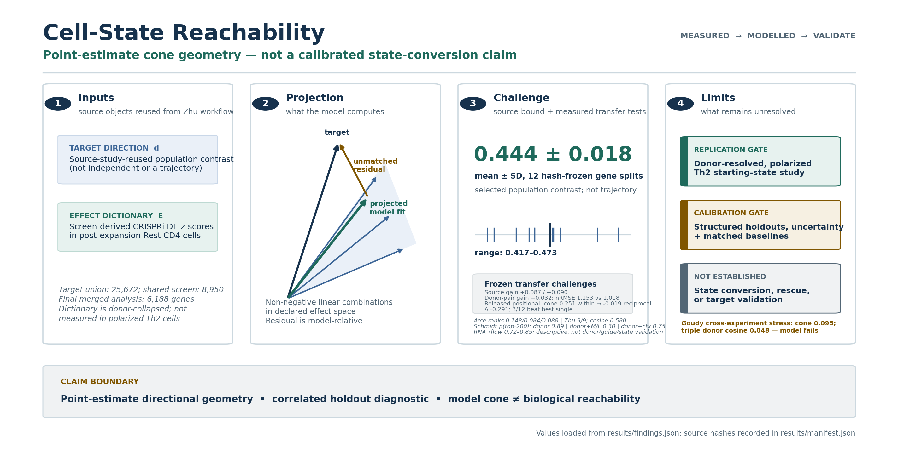

# Cell-State Reachability

[](https://github.com/MasalaKimchi/cell-state-reachability/actions/workflows/ci.yml)
[](LICENSE)

**A geometric, fail-closed test of whether a target transcriptomic direction is
representable by the non-negative cone of a measured perturbation library, with a
model-relative separator when it is not and an adversarial harness that exposes common
false-positive modes.**

An optimizer can return a best fit even when the target lies outside the model generated
by the available measurements or when correlated features inflate the score. This project
therefore answers three bounded questions:

1. **How well does the model align?** The best alignment of a non-negative linear
   combination of measured effects with the target direction.
2. **Is the point estimate inside the declared cone?** If not, the solver returns a
   **model-relative separator** certifying non-representability under that numerical model.
3. **How can the score fail?** A companion harness reproduces common-response inflation,
   random-gene optimism, sign selection, and multiplicity failures.

It emits geometry and diagnostics—not biological reachability, a recipe, a dose, or a
calibrated experimental decision. Exact cone membership is generically strict in noisy,
high-dimensional data; scientific use still requires stability analysis, structured
holdouts, and uncertainty appropriate to the measurement design.



## See it in one screen

```python
import numpy as np
from reachability import project_cone

# Three measured perturbation effect profiles (rows) over four genes (cols)
effects = np.array([
    [1.0, 0.0, 0.0, 0.0],
    [0.0, 1.0, 0.0, 0.0],
    [0.0, 0.0, 1.0, 0.0],
])

# A target inside the reachable cone: a non-negative mix of what you measured
reach = project_cone(effects, np.array([1.0, 1.0, 0.0, 0.0]))
print(reach.geometry_status, round(reach.cosine, 3))
# -> inside_tolerance 1.0

# A target that needs a gene nothing moves, in a direction nothing supports
outside = project_cone(effects, np.array([0.0, 0.0, -1.0, 1.0]))
print(outside.geometry_status, round(outside.separation_margin, 3))
# -> outside_model_cone 1.0      (dual_separator is the infeasibility certificate)
```

The core API emits projection geometry, KKT diagnostics, a model-relative separator, and
held-out scores. The optional library layer ranks supplied, already-measured candidate
effect atoms by a declared computational objective; neither API emits a wet-lab
recommendation.

## What the evidence shows, by tier

The method is the headline. The T-cell case study below is the proving ground that shows
the discipline holds on a real genome-scale screen — not the claim itself. Full numbers and
interpretations live in [findings](docs/FINDINGS.md); every value here is copied from
[`results/findings.json`](results/findings.json).

### MAIN — the method and its honesty machinery

| Component | What it does |
|---|---|
| **Reachability geometry + infeasibility certificate** (`reachability.py`) | Non-negative projection with KKT/separator diagnostics that certify at `1e-8` or fail closed; emits a model-relative separator when the target is outside the measured cone. |
| **Adversarial validation harness** (`scripts/run_validation_harness.py`) | Six data-free scenarios (**PASS**) that reproduce common-response inflation, random-gene optimism vs module holdout, and sign-selection inflation. Fast maxT check: **24/500** false families, exact one-sided 95% upper bound **0.067** under a 0.075 gate. |

### SUPPORTING — the proving ground (Zhu Th2→Th1 case study)

| Source-bound result | Interpretation |
|---|---|
| **0.444 ± 0.018** (range 0.417–0.473) | Held-out cosine over 12 hash-frozen random-gene splits; split variation, not donor uncertainty. |
| **25,672 → 11,616 → 7,960 → 6,188 genes** | Target union → shared sources → concordant signs → screen-measured registered target. |
| **+0.087 / +0.090 logFC cosine** | Ota→Höllbacher / reverse mean gain over the better of a mean ray and best single atom in 6/6 correlated splits. Directional only: normalized RMSE does not improve. |
| **9/9 retrieval; median centered cosine 0.580; cytokine Spearman 0.717–0.850** | Source-selected arrayed bulk-RNA replication after masking every panel target gene, plus IL-10/IL-21 RNA-to-flow consistency across six follow-up donor labels. Cross-platform replication, not held-out discovery. |

### SUPPLEMENTARY / STRESS — the boundary map (including negative results)

| Result | Interpretation |
|---|---|
| **Donor-pair +0.032 cosine; nRMSE 1.153 vs 1.018** | Weak directional gain (75% of 24 challenges) but magnitude **fails** — worse than best single in 23/24. Released eligibility + four fixed donors preclude leakage-free or population claims. |
| **Released guide ranks: cosine 0.251227 within → −0.019197 reciprocal; nRMSE 1.386696 vs 1.017276** | Negative reciprocal-rank stress over 8,323 common category-labeled `Rest` atoms; 2,752 `guide_1`-only category-labeled `Rest` atoms are excluded and 35 nominal `guide_1` `Rest` keys are withheld for missing categorical metadata. Cone gain over the training-selected best single is −0.020345 (positive in only 3/12 rows); joint target-source transfer is also negative (cosine −0.034383; gain −0.041518). VCP defines the ranks from alphanumerically sorted sgRNA IDs, but the H5MU does not embed ID/sequence and this repository has not hash-cross-verified the exact rank-to-ID mapping. Effectiveness selection precludes named-sgRNA replication or leakage-safe guide generalization. |
| **Arce Spearman 0.148 / 0.084 / 0.088** | Cross-study CRISPRi-transcript → CRISPR-KO CD25 ranking alignment (resting Teff / stimulated Teff / resting Treg). Modest and context dependent. |
| **Schmidt whole-genome donor Spearman 0.135–0.332; top-200 0.887 / 0.300 / 0.749** | Independent primary-T-cell functional-screen stress. The conditional top-200 values jointly test held donor alone / donor + modality/library / donor + cytokine/cell-type context. They do not isolate those axes; whole-genome modality-plus-library agreement is only 0.020–0.036. |
| **Goudy component cone: cosine 0.0949, nRMSE 0.9952, strict 0/4** | Negative cross-experiment CRISPRoff stress: equal-sum cosine/nRMSE 0.0646/2.3084, LODO cosine 0.0881, and triple pairwise-donor cosine 0.0480; no filter threshold rescues the model. Execution `PASS`; geometry `FAILS_DECLARED_GEOMETRIC_MODEL`; biological status `INCONCLUSIVE_CROSS_EXPERIMENT_CONFOUNDING_LOW_RELIABILITY`. |

Under this framing the negative results are a feature: they are the evidence that the tool
surfaces its own limits instead of hiding them.

### EXTENSION — retrospective effect-dictionary coverage

`library_coverage.py` applies the same projection to a catalog: it reports strict cone
membership separately from cosine-threshold coverage, measures leave-one-out redundancy,
and ranks supplied candidate effect vectors against certified gap normals. Zhu and
Replogle are retrospective same-screen compression/oracle tests; Norman is a measured
single-to-double additivity diagnostic. None is prospective library design or evidence
about unmeasured perturbations. The v3 audit splits roles before feature selection, groups
Norman genes before role assignment, and adds 12 deterministic partitions with best-atom,
common-response, and signed-span comparators. Strict membership is absent from every
reference catalog and every sensitivity split; the cone beats both simple rays in all 36
splits, but certificate and realized top candidates differ in 3/3 audits. Full metrics,
provenance, and claim ceilings live in
[`results/library_coverage_crossdataset.json`](results/library_coverage_crossdataset.json).

The formerly displayed **0.446 ± 0.010** and **p = 1/61** were retired. Their deleted
pipeline depended on an unhashed `inputs.npz` whose gene order was not preserved. The
separately archived fixed split (0.448154) reproduces within `3e-10`; it is retained only
as provenance, not as the headline.

## Who it is for

Researchers with a measured perturbation-effect dictionary and a target direction who need
an auditable geometric fit, an explicit model-relative failure certificate, and diagnostics
that keep numerical representability separate from biological claims. The library layer is
useful for retrospective coverage and redundancy audits when candidate effect vectors are
already available.

## Read more

The full per-result detail and claim ceilings are in [findings](docs/FINDINGS.md) and
[methods](docs/METHODS.md). See also [technical validation](docs/VALIDATION_REPORT.md), the
[scientific validation plan](docs/SCIENTIFIC_VALIDATION_PLAN.md), and the runnable
[tutorial](tutorial/tutorial.ipynb).

## Run the maintained surface

Install the four-module API from a clone with `python -m pip install .`. To run the full
frozen reproduction contract instead:

```bash
python -m pip install -r requirements.txt
./reproduce.sh
```

The small reproduction path runs the numerical tests, demo, systemic harness check, and
artifact-lineage validation. External scientific data are gitignored. With the registered
inputs available:

```bash
python -m pip install -r requirements-external.txt
python scripts/run_source_reconstruction.py --check results/source_reconstruction.json
python scripts/run_arce_external_validation.py --check
python scripts/run_zhu_arrayed_validation.py --check
python scripts/run_donor_pair_transfer.py --check
python scripts/run_guide_pair_transfer.py --check
python scripts/run_goudy_combination_validation.py --check
python scripts/run_schmidt_external_validation.py --check
python scripts/build_library_coverage_caches.py --dataset all --check
python scripts/run_library_coverage_crossdataset.py --check
```

Available source routes, hashes, licenses, reconstructable-cache contracts, and remaining
durable-availability boundaries are in
[data/README.md](data/README.md); the retrospective coverage audit has a separate,
machine-readable [dataset card](configs/library_coverage_crossdataset.json).

## Repository map

Tier reflects the center of gravity: **MAIN** is the method and its honesty machinery,
**SUPPORTING** is the proving-ground case study, **STRESS** is the boundary map, and
**EXTENSION** is the retrospective catalog layer built on the same geometry.

| Path | Tier | Role |
|---|---|---|
| [`reachability.py`](reachability.py) | MAIN | Projection-only numerical core; infeasibility certificate |
| [`scripts/run_validation_harness.py`](scripts/run_validation_harness.py) | MAIN | Deterministic adversarial synthetic stress harness |
| [`validation.py`](validation.py) | MAIN | Oracle, label/provenance, grouped-split, and multiplicity contracts |
| [`effect_dictionary.py`](effect_dictionary.py) | — | Safe, labeled adapter from preprocessed dense/sparse cell matrices to portable effect dictionaries |
| [`library_coverage.py`](library_coverage.py) | EXTENSION | Strict/thresholded catalog coverage, redundancy, gap normals, and ranking of supplied measured candidates |
| [`scripts/build_library_coverage_caches.py`](scripts/build_library_coverage_caches.py) | EXTENSION | Hash-gated, byte-stable reconstruction of all three portable effect dictionaries |
| [`scripts/run_library_coverage_crossdataset.py`](scripts/run_library_coverage_crossdataset.py) | EXTENSION | Retrospective audit on Zhu, Norman, and Replogle, single-sourced to `results/library_coverage_crossdataset.json` |
| [`scripts/run_source_reconstruction.py`](scripts/run_source_reconstruction.py) | SUPPORTING | Full-file-hash-bound target and cross-source reconstruction |
| [`scripts/run_zhu_arrayed_validation.py`](scripts/run_zhu_arrayed_validation.py) | SUPPORTING | Source-selected arrayed bulk-RNA and donor-normalized cytokine follow-up |
| [`scripts/run_donor_pair_transfer.py`](scripts/run_donor_pair_transfer.py) | STRESS | Frozen-weight donor-pair transfer sensitivity (magnitude-fails negative result) |
| [`scripts/run_guide_pair_transfer.py`](scripts/run_guide_pair_transfer.py) | STRESS | Frozen-weight reciprocal transfer across released guide-rank summaries (negative descriptive result; exact rank-to-sgRNA crosswalk not yet hash-verified) |
| [`scripts/run_arce_external_validation.py`](scripts/run_arce_external_validation.py) | STRESS | Independent CD25 transfer plus donor/guide supplied-score robustness |
| [`scripts/run_goudy_combination_validation.py`](scripts/run_goudy_combination_validation.py) | STRESS | Hash-gated GSE306915 negative cross-experiment CRISPRoff stress report |
| [`scripts/run_schmidt_external_validation.py`](scripts/run_schmidt_external_validation.py) | STRESS | Hash-gated two-donor CRISPRa/CRISPRi cytokine-screen rank-transfer stress report |
| [`results/findings.json`](results/findings.json) | — | Canonical machine-readable findings |
| [`tutorial/tutorial.ipynb`](tutorial/tutorial.ipynb) | — | Fast clean-clone walkthrough with structured-holdout and labeled-input safeguards |
| [`docs/SCIENTIFIC_VALIDATION_PLAN.md`](docs/SCIENTIFIC_VALIDATION_PLAN.md) | — | Ordered statistical, ML, and biological execution program |

## Hard boundaries

- The aggregate primary effects are donor-collapsed; donor-pair modalities are
  published-eligibility-selected two-donor summaries; all random-gene splits are correlated.
- The target was constructed from sources reused by the source study.
- Source-transfer baselines are limited; directional gains do not imply magnitude accuracy.
- Arce S1 is aggregate; S14 adds two-donor/two-guide robustness for an incompletely
  specified supplied score, not donor-population or functional validation.
- VCP defines Zhu `guide_1`/`guide_2` as first/second sgRNA IDs after alphanumeric sorting
  within target-condition, and public companion artifacts carry IDs. The ranked H5MU does
  not embed sgRNA ID/sequence, and this repository has not reconstructed and
  hash-cross-verified the exact rank-to-ID mapping. With `guide_2` a strict subset and
  upstream effectiveness-based eligibility, the fixed reciprocal-rank result neither
  demonstrates named-sgRNA replication nor supports leakage-safe guide generalization.
- Schmidt uses two fixed donors and the same guides within each modality. Its CRISPRa/i
  contrast also changes Calabrese/Dolcetto libraries, while IL2/IFNG also changes
  CD4/CD8 context; cross-screen top-effect rows additionally change donor. Conditional
  concordance is not an isolated-axis estimate, guide generality, or population generality.
- The Zhu arrayed panel contains nine source-selected perturbations with unequal coverage
  across six follow-up donors; it is cross-platform replication, not held-out discovery.
- The Goudy stress test compares one triple with target-matched singles across different
  experiments, AAVS1-versus-multiplex-NTC controls, and guide burdens; D3/D4 triple/NTC
  experiment IDs and the triple guides are unresolved. Same-experiment, control- and
  guide-burden-matched measured combinations remain untested.
- Established polarized Th2 cells, leakage-safe donor/guide holdout, matched CRISPRa,
  chromatin, durability, fitness, and functional state conversion remain untested.
- Exact point-estimate cone membership is not a calibrated biological decision rule; the
  current catalog extension is retrospective and uses already-measured candidate effects.

## License

MIT. Source-data licenses and citation requirements are recorded separately in
[data/README.md](data/README.md). Software citation metadata is in
[`CITATION.cff`](CITATION.cff).
