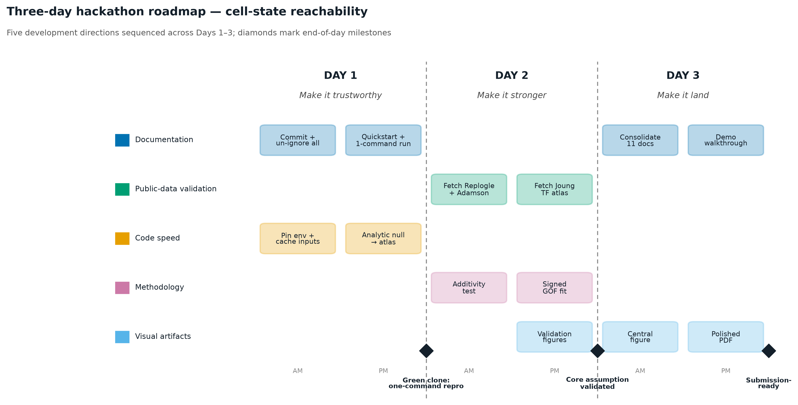

# Roadmap — Cell-State Reachability (3-day hackathon push)

**Built with Claude: Life Sciences (Lab Track) · July 7–13, 2026**

> **Read this in 30 seconds.** This project asks a question every drug-discovery
> team faces but no existing tool answers directly: *given a big screen of gene
> perturbations, can we reach a desired cell state — and if not, what's stopping
> us?* The engine is built and it works on real data. **These three days turn a
> working prototype into a submission a judge can clone, trust, and understand.**

---

## What this project is (plain language)

A cell's identity is written in which genes are on and off. A **Perturb-seq
screen** measures what happens to a cell when you switch thousands of genes off,
one at a time. Our method treats each of those measured effects as a *move* you
can make, and asks a geometry question:

> **Can we combine these moves to steer a cell from a starting state to a target
> state — and how far can we actually get?**

The answer is a **verdict with a receipt**: *reachable* (here is the smallest set
of genes to change), or *provably not reachable this way* (here are the exact
genes that would have to be switched **on** instead, which knocking genes off can
never do). That "provably not, and here's why" is the part no ranking tool
delivers — and it's the part that saves a lab from running an experiment that was
doomed before it started.

**Why anyone cares.** About 9 in 10 drug programs fail, and the most common
reason is picking the wrong target — a decision made years and millions of
dollars before the failure shows up. Two things are known to improve those odds:
using *measured* effects instead of *inferred* ones, and cross-checking targets
against human genetics. This method is built on both. It doesn't promise a target
works; it tells a team **where to look first, and where not to look at all.**

---

## Where we are, and what these 3 days do

**The science is largely built.** The method module (`reachability.py`, ~1,200
lines) implements the full pipeline: the reachability verdict, the "what to
activate instead" certificate, a signed loss-of-function / gain-of-function
split, a fast minimal-recipe search, honest statistical nulls, and an
experiment-design tool. It has produced a validated headline result on real CD4⁺
T-cell data, a 12-condition atlas, a cross-dataset replication on a second
public screen, and a druggability triage of 102 candidate targets.

**The gap is not the science — it's the packaging.** Today, a judge who clones
the repo gets no environment file, no one-command way to reproduce a figure, 11
overlapping documents with no clear front door, and most of the real work sitting
uncommitted. The single biggest risk to the *submission* is that great science
looks unfinished.

So the three days follow one arc, and each day has one job a non-expert can hold
in their head:

| Day | Theme | The job |
|-----|-------|---------|
| **Day 1** | **Make it trustworthy** | Anyone can clone the repo and reproduce a result with one command. |
| **Day 2** | **Make it stronger** | Confirm the core scientific claims on *additional independent* public datasets. |
| **Day 3** | **Make it land** | One clear story, one hero figure, one clean front door — ready to submit. |

---

## The five directions at a glance

Your five requested directions map onto the three days as shown below. Each row
says where it stands now, the concrete 3-day goal, and — in one plain sentence —
why it matters for the submission.

| # | Direction | Where it stands | 3-day goal | Why it matters (plain language) |
|---|-----------|-----------------|------------|----------------------------------|
| 1 | **Documentation for others** | 11 docs, ~31k words, no single entry point; most work uncommitted | One `README` front door + `QUICKSTART` + everything committed | A judge (or future user) can *start* in 2 minutes instead of 20. |
| 2 | **More public data for validation** | 1 replication done (Norman 2019); a 13-dataset catalog scoped | Replicate the two load-bearing claims on 2–3 more public screens | Turns "it worked once" into "it works across labs and assays" — the manuscript-grade bar. |
| 3 | **Faster code** | Cone fit is fast (~45 s); the statistical null is the bottleneck (~12 min/target) | Wire the already-validated closed-form null through the whole atlas | The full analysis reruns in minutes, so a judge can actually run it live. |
| 4 | **Deeper methodology** | Signed reachability + additivity law already built & validated on one dataset | Show those advances *transfer* to independent gain-of-function & combinatorial data | Proves the new methods are general laws, not one-dataset curiosities. |
| 5 | **Better visuals** | ~20 figures exist but scattered; no single hero figure | One captioned figure set + one "read-me-first" central figure | The impact is understood at a glance, by someone outside the field. |

---

## Day-by-day plan

Each block below is a half-day of focused work with a concrete **Definition of
Done (DoD)** — the checkable condition that says the block is finished. Time
estimates assume one to two builders with Claude Code / Claude Science.

### Day 1 — Make it trustworthy
*Goal: a stranger clones the repo and reproduces a real figure with one command.*

**Morning — Capture and commit everything.**
- **Task.** Commit the current working tree on a clean branch: the method module,
  all four notebooks, every result table, and the current docs. Un-ignore the
  figures and small result CSVs that a reader needs to see (large data stays
  out). Add a permissive `LICENSE` note and a `.gitignore` that keeps only the
  16.8 GB data file and caches out of version control.
- **DoD.** `git status` is clean; a fresh clone contains every figure and table
  referenced in the docs. Nothing that a judge needs is missing.

**Afternoon — Pin the environment and give it one command.**
- **Task.** Freeze the working conda environment into a committed
  `environment.yml` **and** a `requirements.txt` (exact versions). Add a tiny
  `make reproduce` / `python -m reachability` entry that runs the module
  self-test and regenerates one headline figure from the cached inputs
  (`analysis_cache/atlas_work/inputs.npz`) — no 16.8 GB download required. Write a `QUICKSTART.md`:
  clone → create env → one command → see a figure.
- **DoD.** On a clean machine, `conda env create -f environment.yml` then the one
  command produces `fig1_reachability_spectrum.png` in under 2 minutes, from a
  fixed seed, with no manual steps.

> **🏁 End of Day 1 milestone — "Green clone."** The repository reproduces a real
> result on any machine with a single command. This alone clears the Lab Track's
> "reproducible analysis" bar.

### Day 2 — Make it stronger
*Goal: the two load-bearing scientific claims are confirmed on independent public data.*

The method already ships two non-obvious methodological advances, each validated
on **one** dataset. Day 2 tests whether they **transfer** — the difference
between a result and a law. All datasets are public GEO series confirmed
reachable from the analysis environment (GEO is accessible; portals like
CELLxGENE and clue.io are not, so the plan uses GEO only).

**Morning — Bring in independent screens.**
- **Task.** Fetch and format two combinatorial screens that measure *both* single
  and paired perturbations: **Replogle et al. 2020** (`GSE146194`, K562) and
  **Adamson et al. 2016** (`GSE90546`, UPR). These are the only kind of data that
  can independently test the method's central *additivity* assumption, because
  they contain measured double-perturbations to compare against.
- **DoD.** Both effect matrices load into the method's input format; a smoke-test
  reachability fit runs on each without error.

**Afternoon — Replicate the two claims, and extend the modality reach.**
- **Task A — Additivity law transfer.** The additivity/epistasis penalty was
  calibrated on Norman 2019 (a saturation law, not simple collinearity). Re-fit it
  on Replogle and Adamson doubles and report whether the same law holds. **Task B —
  Gain-of-function transfer.** The signed (activation) reachability was shown on
  one dataset; fetch **Joung et al. 2023** TF atlas (`GSE216463`), a true
  overexpression basis, and confirm the signed method recovers a sensible
  activation verdict on genuine gain-of-function data.
- **DoD.** A short results table per dataset: does the saturation law replicate
  (yes/no + numbers)? Does the signed fit behave correctly on real activation
  data? Honest verdicts either way — a clean negative is still a finding.

> **🏁 End of Day 2 milestone — "Core assumption validated."** The method's two
> newest ideas are shown to hold (or their limits are honestly mapped) on data it
> was never tuned to. This is the manuscript-grade validation layer.

### Day 3 — Make it land
*Goal: one story, one hero figure, one front door — submission-ready.*

**Morning — One figure set, captioned for a non-expert.**
- **Task.** Consolidate the ~20 scattered figures into a numbered set with
  plain-language captions (each caption answers "what am I looking at, and why
  does it matter?"). Finalize a single **central figure** that tells the whole
  story in one panel: *screen → reachability verdict → the "reach vs. must-activate"
  split → the ranked recipe and the certificate.* Embed the figure set into the
  notebooks so each result is shown, not just described.
- **DoD.** A reader who sees only the central figure and its caption can state
  what the method does and why it's useful.

**Afternoon — One front door, then the polished submission package.**
- **Task.** Collapse the 11 documents into a clear hierarchy: a rewritten
  top-level `README` (the front door), with the deep-dive docs linked as
  appendices. Record a short demo walkthrough (or a scripted notebook run).
  Produce the polished PDF (executive one-pager + this roadmap) for sharing with
  non-expert judges.
- **DoD.** The `README` answers *what/why/how-to-run/what's-the-result* above the
  fold; the PDF is generated and reviewed.

> **🏁 End of Day 3 milestone — "Submission-ready."** A judge lands on the README,
> understands the impact in a minute, reproduces a figure in two, and reads a
> validated, cross-dataset result. Done.

---

## Success criteria

**Overall — the submission is "done" when:**
1. A fresh clone reproduces a headline figure with **one command**, fixed seed,
   under 2 minutes, no large download.
2. At least **two independent public datasets** corroborate (or honestly bound)
   the additivity law and the signed-reachability behavior.
3. The full atlas re-runs in **minutes, not hours**, using the closed-form null.
4. A non-expert can read the `README` + central figure and correctly explain
   *what the method decides and why it matters.*
5. Every claim in the docs points to a committed figure or table that a reader
   can open.

**Per day:** Day 1 → "Green clone." · Day 2 → "Core assumption validated." ·
Day 3 → "Submission-ready." (See milestones above.)

---

## Risks & mitigations

| Risk | Likelihood | Impact | Mitigation |
|------|-----------|--------|------------|
| Public dataset download/format friction eats Day 2 | Medium | Medium | Datasets pre-verified live on GEO; if one stalls, the other combinatorial screen still tests additivity — one clean transfer suffices for the claim. |
| A replication *fails* (law doesn't transfer) | Medium | Low | A negative is a legitimate, honest result — report the boundary of validity. It strengthens credibility, not weakens it. |
| Environment won't pin cleanly across machines | Low | High | Pin exact versions on Day 1 AM (not Day 3); test in a fresh env immediately; `requirements.txt` as fallback to conda. |
| Scope creep — trying to add new science | Medium | High | New methods are **stretch goals only** (below). The core 3 days are packaging + replication of *existing* results. |
| Large data file (16.8 GB) blocks reproduction | Certain | High | Ship cached reduced inputs (`inputs.npz`); the one-command path never touches the raw file. |
| Time lost re-deriving results already done | Medium | Medium | This roadmap is grounded in an audit of the actual repo — Day 2 *replicates existing* claims on new data, it does not rebuild them. |

---

## Stretch goals (only if ahead of schedule)

Clearly separated so the core plan never depends on them:

- **A third replication axis** — the LINCS L1000 drug-signature series for a
  drug-combination reachability demo (much larger; only if Day 2 finishes early).
- **A small interactive explorer** — pick a target state + condition, see the
  verdict, recipe, and certificate. Judge-friendly, but a "nice to have."
- **Leave-one-donor-out robustness** re-run across all 12 atlas cells with the
  fast null (now cheap enough to be routine).
- **A one-page methods write-up** in preprint style, seeded from `RESULTS.md`.

---

## Explicitly out of scope (honesty guardrails)

- No wet-lab validation or clinical claims — every nomination is a *hypothesis
  for testing*, not a validated target.
- No retraining of foundation models or GPU-scale work — the method is CPU-only
  by design, and that is a feature.
- No reprocessing of raw sequencing data — the analysis starts from the
  published effect matrices.

---

*This roadmap was generated from a direct audit of the repository's current
state (method module, notebooks, results, and docs) and a live check that the
recommended validation datasets are publicly reachable. Companion documents:
[`RESULTS.md`](./RESULTS.md) (what the method found — including the modality triage,
generalizability, and design toolkit), [`NOVELTY.md`](./NOVELTY.md) (what's
scientifically new, why it matters to drug discovery, and the field positioning),
[`RELATED_WORK.md`](./RELATED_WORK.md) (the prior-method survey), and
[`CAUSAL.md`](./CAUSAL.md) (the causal-inference reframe and validation layer).*
