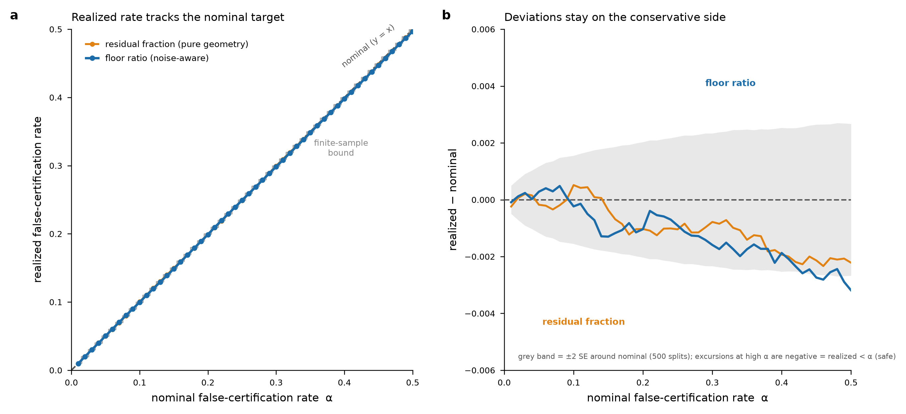
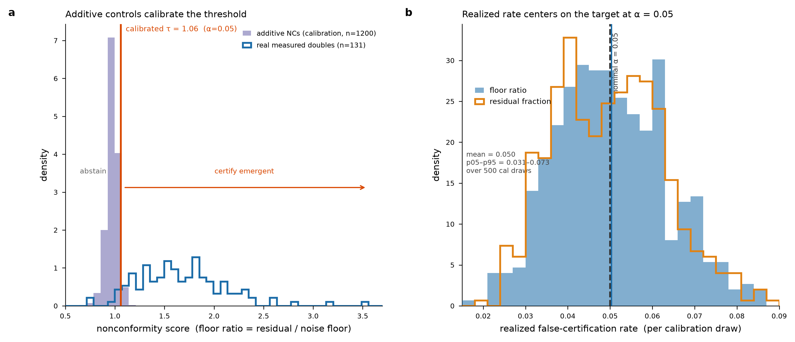

# I1 — Conformal / selective-prediction certificate layer

**What this adds.** CombiCone's shipped emergence certificate already emits a
machine-precision separator, a noise-injection p-value, and a two-bar verdict
(significance **and** a hand-picked `floor_ratio >= 1.9`). This layer wraps that
geometry in a **split-conformal (selective-prediction / "reject option")**
calibration so the certificate carries a **distribution-free, finite-sample
false-certification rate** at a target level `alpha`. The verdict is reformulated
as an explicit rule with a stated coverage guarantee:

> **certify emergent** if the conformal p-value `p(s*) <= alpha`, else **abstain**.

This upgrades "the separator is exact to machine precision" (a statement about the
*geometry solver*) into "**abstention with a stated error rate**" (a statement
about the *decision*): we now control how often the rule certifies an input that
is actually non-emergent.

- **Module:** [`conformal_certificate.py`](../../conformal_certificate.py) — new, does
  **not** modify `combicone.py` (imports it).
- **Numbers:** [`results/conformal_certificate.json`](../../results/opportunities/conformal_certificate.json)
- **Figures:** `conformal_coverage.png`, `conformal_fcr.png`

---

## 1. Method

### 1.1 Nonconformity score

Conformal prediction needs a scalar *nonconformity score* — higher = more
"surprising" relative to the non-emergent null. Both scores are read straight out
of the existing CombiCone geometry; **nothing new is fitted**:

| score | definition | source | needs noise model? |
|---|---|---|---|
| `floor_ratio` *(default)* | `residual_fraction / noise_floor` | `combicone.certify_emergence` (analytic null) | yes — split-half `|t1 − t2| / 2` |
| `residual_fraction` | metric-whitened cone residual fraction | `reachability.project_cone` | no (pure geometry) |

`floor_ratio` is *exactly the quantity the shipped two-bar verdict thresholds at
1.9*. The conformal layer replaces that hand-picked constant with a
distribution-free, `alpha`-calibrated threshold. It is the recommended score
because a truly additive combination has residual ≈ noise floor, so its floor
ratio concentrates at ≈ 1.0 **by construction** — an ideal, tight null.
`residual_fraction` is the purest distribution-free story (no noise assumption at
all) but leaves the score confounded with per-combination noise magnitude.

### 1.2 Calibration set — additive negative controls

The calibration set is a bank of **additive negative controls**: `add =
atom_i + atom_j` for real Norman single-gene atoms, plus real per-gene split-half
measurement noise (`|t1 − t2| / 2`, sampled from the measured doubles). The
deterministic part is a non-negative mixture of two atoms, hence **inside the cone
by construction — non-emergent by design**. This is the *same* negative-control
construction the repo's `scripts/certificate_dossier.py` already uses to report
specificity; here we reuse it as a *calibration* set so the certificate inherits a
**guaranteed** rate rather than an observed one.

### 1.3 The selective rule and its guarantee

Given `n` calibration scores `s_1..s_n` and a test score `s*`, the one-class
("conformal anomaly detection") conformal p-value is

```
p(s*) = (1 + #{ i : s_i >= s* }) / (n + 1)
```

We **certify emergent iff `p(s*) <= alpha`**, else **abstain**. Equivalently,
certify iff `s* >= tau`, where `tau` is the `ceil((1 − alpha)(n + 1))`-th smallest
calibration score (the standard split-conformal quantile). If a test combination
is truly non-emergent and **exchangeable** with the calibration controls, `p(s*)`
is super-uniform, so

```
P(falsely certify) = P(p(s*) <= alpha) <= alpha,
```

with exact finite-sample expectation `floor(alpha (n+1)) / (n+1)`. **No assumption
on the shape of the score distribution is used — only exchangeability.**

---

## 2. The exchangeability assumption (stated honestly)

This is the one assumption doing the work, so it is spelled out plainly.

1. **Exact for the synthetic-additive null.** The additive negative controls are
   i.i.d. draws of one generative process, so they are exchangeable *by
   construction*. The false-certification bound is therefore **exact** against the
   additive-NC null — this is what the coverage curve in §3 verifies (calibration
   and test points are both held-out additive NCs).
2. **Approximate for a real additive double.** A real measured double that happens
   to be additive is only *approximately* exchangeable with the synthetic controls:
   its idiosyncratic per-gene noise structure, and the exactness of the synthetic
   additive part, differ from the calibration draws. The bound is anchored to the
   additive-NC null; on real doubles we can report the certify/abstain **split**,
   but not claim ground-truth emergence (which is unknown — there is no wet-lab
   emergence label).
3. **`floor_ratio` adds one more assumption:** that the split-half `|t1 − t2| / 2`
   is the true per-gene measurement SE. `residual_fraction` makes **no** noise
   assumption and is the fallback when the split-half estimate is distrusted.
4. **Model-relative throughout.** "Emergent" means "outside the non-negative cone
   of *these* atoms under *this* metric," never biological impossibility — the same
   scope the rest of CombiCone declares. The guarantee is a **false-certification
   rate against an additive null**, not a biological false-discovery rate.

**What the guarantee is NOT:** it is not a bound on missing true emergence (that is
the abstention/power side, uncontrolled here), and it is not a statement that a
certified pair is biologically synergistic.

---

## 3. Empirical coverage (COMPUTED on the real Norman substrate)

Calibration/test on additive negative controls (exchangeable by construction):
`n_cal = 500`, `n_test = 700`, averaged over `500` random splits, `alpha` swept on
`[0.01, 0.50]`.



**Realized false-certification rate tracks the nominal target, and every
deviation is on the conservative side.** The largest excess of realized *over*
nominal across the whole grid — the only direction that could threaten the
`FCR <= alpha` guarantee — is **+0.0005** (floor ratio), smaller than the ±SE of
the estimate. At small-to-moderate `alpha` (the operating regime) the curve sits
on the exact finite-sample bound `floor(alpha (n+1))/(n+1)`; at high `alpha`
(≳ 0.42) the floor-ratio realized rate dips systematically *below* nominal
(reaching ≈ −0.003, ≈ 2.4 SE at `alpha = 0.5`) — a conservative excursion
(realized < nominal, `FCR` still bounded), not a violation. Panel B draws the
±2 SE band around zero so this is visible: excursions leave the band only
downward.

| alpha | realized FCR (floor ratio) | realized FCR (residual) | finite-sample bound |
|------:|---------------------------:|------------------------:|--------------------:|
| 0.01 | 0.0099 | 0.0098 | 0.0100 |
| 0.05 | 0.0503 | 0.0498 | 0.0499 |
| 0.10 | 0.0998 | 0.1005 | 0.0998 |
| 0.20 | 0.1990 | 0.1990 | 0.1996 |
| 0.50 | 0.4968 | 0.4978 | 0.4990 |

### Operating point (`alpha = 0.05`)



The additive controls concentrate at floor ratio ≈ 0.97 (p95 = 1.06), giving a
calibrated threshold **`tau = 1.06`** at `alpha = 0.05`. The **marginal** realized
FCR is 0.050; the **training-conditional** FCR (for a single fixed calibration
draw) has mean 0.050 and spans **p05–p95 = 0.031–0.073** — an honest reminder that
the split-conformal guarantee is *marginal over calibration draws*, not conditional
on one calibration set. (Training-conditional control would need a Mondrian/
calibration-conditional variant; the marginal guarantee is what split-conformal
delivers and what the curve verifies.)

---

## 4. Selective outcome on the 131 real measured doubles

Calibrating on the full bank of 1200 additive NCs and applying the rule to the real
Norman doubles:

- **115 / 131** real doubles fall **entirely above** the additive-NC floor-ratio
  support → they receive the minimum achievable conformal p (`1/(n+1) ≈ 8.3e-4`)
  and certify at any `alpha >= 8.3e-4`.
- At `alpha = 0.05`: **124 certify, 7 abstain** (floor ratio). With the
  no-noise-model `residual_fraction` score the split is more conservative (21
  certify at 0.05), reflecting its magnitude confound.
- **5 of the 7 abstentions are mechanistically coherent same-pathway pairs** —
  exactly the redundant combinations that *should* read as non-emergent:
  `BCL2L11+BAK1` (pro-apoptotic BCL2 family), `CDKN1C+CDKN1B` (CDK inhibitors),
  `KIF18B+KIF2C` (kinesins), `PLK4+STIL` (centriole biogenesis), `CBL+UBASH3A`
  (TCR-signaling suppressors). The remaining two — `C3orf72+FOXL2`,
  `SAMD1+TGFBR2` — abstain on the geometry (floor ratio ≈ 1.0) but are not claimed
  here to be same-pathway. This is a construct-validity signal: abstention rejects
  the collinear pairs.

### Relationship to the shipped two-bar verdict

The conformal rule answers a **different question** than the `floor_ratio >= 1.9`
bar, and the two **compose** rather than compete:

- **Conformal** = distribution-free **false-certification-rate control** — "is this
  score beyond what the additive null produces, at rate `alpha`?"
- **The 1.9 floor bar** = a fixed **effect-size filter** — "is the emergence large
  enough to be worth chasing?"

At `alpha = 0.05` the conformal-certified set (124) is a **strict superset** of the
repo's two-bar certified set (40): overlap 40, conformal-only 84, two-bar-only 0.
The recommended production verdict is the **conjunction** — *conformally
significant* (FCR-controlled) **AND** clears a chosen effect-size floor — which
keeps CombiCone's effect-size discipline while giving the significance leg a stated
error rate instead of a hand-picked p-threshold.

---

## 5. How to use it

```python
import numpy as np, combicone as cc, conformal_certificate as conf

z = np.load("combicone_substrate.npz", allow_pickle=True)
atoms = z["atoms"]
cond  = list(z["conditions"]); means = z["means"]; ctrl = z["ctrl"]
m1, m2 = z["means1"], z["means2"]
doubles = [str(d) for d in z["doubles"]]
noise_pool = np.abs(m1[[cond.index(d) for d in doubles]]
                    - m2[[cond.index(d) for d in doubles]]) / 2.0

# 1. Calibrate on additive negative controls (analytic null -> cheap)
calib = conf.calibrate_from_additive_controls(
    atoms, noise_pool=noise_pool, score="floor_ratio",
    n_controls=500, alpha=0.05, seed=0)

# 2. Selective certificate for a measured combination
name = "SET+CEBPE"
eff  = means[cond.index(name)] - ctrl
sd   = np.abs(m1[cond.index(name)] - m2[cond.index(name)]) / 2.0
v = conf.selective_certify(calib, atoms, eff, noise_sd=sd)
print(v.decision, v.conformal_p)     # -> 'certify_emergent'  0.002 (= 1/(500+1), the min p)
```

`score="residual_fraction"` drops the `noise_sd` requirement entirely (pure
geometry) at the cost of the magnitude confound.

---

## 6. Provenance

- **COMPUTED** from the real Norman substrate (`combicone_substrate.npz`): 105
  single-gene atoms, 131 measured doubles, real split-half noise.
- **SYNTHETIC (labeled as such):** the additive negative-control calibration set is
  synthesized from real atoms + real noise — the same construction as
  `scripts/certificate_dossier.py::negative_control_additive`. These are *by design*
  non-emergent; that is what makes them a valid calibration set. No real data is
  fabricated or simulated as a substitute.
- **DESIGN-ONLY:** none — every number here is computed.
