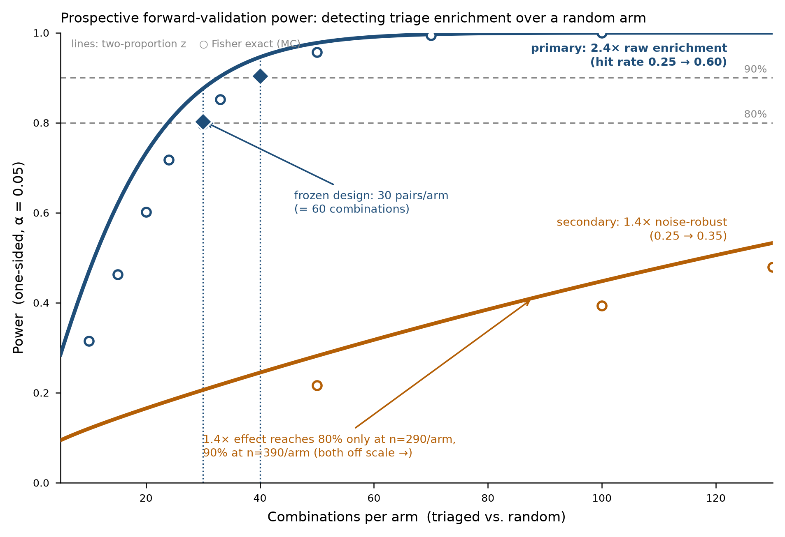

# E2 — Prospective Forward-Validation Protocol for CombiCone Triage

**Status: DESIGN-ONLY (wet-lab spec).** No benchtop experiment has been run. This
document specifies a pre-registered prospective test that converts CombiCone's
*retrospective* triage enrichment into a *forward-validated hit rate*. It is the
"Workstream 5" item in `docs/SCIENTIFIC_VALIDATION_PLAN.md` (currently *not
started*: "convert the retrospective 2.4× triage enrichment into a
forward-validated hit rate on a screen run after the prediction ... requires
wet-lab partnership; no prospective or efficacy claim exists today").

Everything below is either **COMPUTED** from the real Norman substrate
(`combicone_substrate.npz`) using the repo's own machinery, or **DESIGN** (the
harness/protocol the wet lab would execute). Each section is labeled.

---

## 0. What this test does and does not claim

- **Tests (H1):** the prospective certified-emergence hit rate among
  CombiCone-triaged unmeasured pairs is **higher** than among a matched random
  sample of unmeasured pairs, on the **same** screen run after the list was
  frozen.
- **Does NOT claim:** biological synergy, target validation, dosing, efficacy,
  or state conversion. "Emergent" remains *model-relative unreachability from the
  single-gene cone above a stated measurement-noise model* (the `scope`
  disclaimer every CombiCone result carries). The prospective endpoint upgrades
  the evidence from retrospective to forward-validated; it does **not** widen the
  claim ceiling in `SCIENTIFIC_VALIDATION_PLAN.md §6`.
- The triage signal validated on Norman is the **rank** signal (`−cos`). The
  cross-screen note (`FINDINGS.md §4`) is explicit that the magnitude-controlled
  component of triage is screen-specific; this protocol therefore tests triage
  **within the same screen system** (Norman / K562 CRISPRa) where the retrospective
  2.4× was measured, not a new modality.

---

## 1. Pre-registered ranked list (COMPUTED — frozen)

Frozen: `2026-07-21T14:01:40Z`. Substrate: `combicone_substrate.npz` (Norman
combinatorial CRISPRa; distributed file label A549 / canonical Norman 2019
K562 — **no cell-line claim beyond the file label**).

- Universe: all C(105, 2) = **5460** pairs of the 105 measured single-gene atoms;
  131 already measured ⇒ **5329 unmeasured** candidate pairs.
- Triage score: **training-free `−cos`** — the negative mean pairwise cosine
  between the two single-gene effect vectors, via
  `combicone.triage_combinations(atoms, single_genes, order=2, pairwise="mean")`.
  Higher = the two singles push transcription in more different directions = more
  likely emergent. This is the repo's honest default (no labeled pilot required).
- **Arm A (triaged), n=30:** the top-30 unmeasured pairs by triage score.
- **Arm B (random), n=30:** a uniform random sample of the *remaining* unmeasured
  pairs (disjoint from Arm A), drawn with `numpy.random.default_rng(seed=20260721)`.
  This is the locked null-comparison arm. Its mean triage score (−0.28) matches
  the population of unmeasured pairs (−0.23); Arm A's mean is +0.47 — the arms are
  cleanly separated in the predictor, as required for a fair test.

**Freeze integrity.** The 60-row list is `prospective_ranked_list.csv`.
- `ranked_list_sha256` = `05e0e4a04767fa4822a3b59b617b6a41663b0cb974fbaf0853c07c30aac56a8f`
- `semantic_payload_sha256` (arm|pair|score, formatting-independent) = `3265074a7db70ba841fe48bff1f83788478a848af0775d6450e897d213a475a2`
- `substrate_atoms_sha256` (ties the list to the exact input matrix) = `e4f69836086add6314315ff590863aee11c106208969c2fd78e57abbfead5d0f`

The seed and list are frozen **before** any prospective measurement. Re-ranking
after data collection voids the pre-registration.

### Arm A — triaged top-30 (run first)

| rank | pair | triage score (−mean cos) |
|---|---|---|
| 1 | ARRDC3+SLC38A2 | +0.5860 |
| 2 | CSRNP1+IER5L | +0.5804 |
| 3 | CSRNP1+EGR1 | +0.5433 |
| 4 | CSRNP1+POU3F2 | +0.5120 |
| 5 | FOXL2+MAP2K3 | +0.5068 |
| 6 | IER5L+MAP2K3 | +0.5039 |
| 7 | CSRNP1+MEIS1 | +0.4966 |
| 8 | AHR+CSRNP1 | +0.4881 |
| 9 | HOXA13+MAP2K3 | +0.4846 |
| 10 | HOXC13+MAP2K3 | +0.4828 |
| 11 | IER5L+MAP2K6 | +0.4776 |
| 12 | HOXB9+MAP2K3 | +0.4749 |
| 13 | MAP2K3+ZBTB10 | +0.4720 |
| 14 | FOXA3+MAP2K3 | +0.4716 |
| 15 | C3orf72+MAP2K3 | +0.4693 |
| 16 | CBFA2T3+MAML2 | +0.4625 |
| 17 | MAP2K6+PTPN1 | +0.4508 |
| 18 | MAP2K3+POU3F2 | +0.4494 |
| 19 | CSRNP1+FEV | +0.4477 |
| 20 | CSRNP1+MIDN | +0.4475 |
| 21 | MAP2K3+MIDN | +0.4442 |
| 22 | MAP2K3+MEIS1 | +0.4432 |
| 23 | CSRNP1+HOXA13 | +0.4339 |
| 24 | MAP2K6+SGK1 | +0.4315 |
| 25 | CSRNP1+PRDM1 | +0.4219 |
| 26 | DLX2+MAP2K3 | +0.4209 |
| 27 | LYL1+MAP2K6 | +0.4205 |
| 28 | MAP2K6+UBASH3B | +0.4152 |
| 29 | JUN+MAP2K3 | +0.4140 |
| 30 | ARRDC3+MAP2K6 | +0.4134 |

### Arm B — random matched arm (locked, seed 20260721)

| rank | pair | triage score |
|---|---|---|
| 1 | AHR+SPI1 | -0.4750 |
| 2 | ATL1+HOXA13 | -0.5964 |
| 3 | BPGM+CBL | -0.7377 |
| 4 | C3orf72+CBL | -0.2806 |
| 5 | C3orf72+HES7 | -0.6225 |
| 6 | CBL+DLX2 | +0.0338 |
| 7 | CDKN1B+KLF1 | -0.1547 |
| 8 | CDKN1C+FOXL2 | -0.3645 |
| 9 | CEBPA+FOXA3 | -0.3551 |
| 10 | CNN1+GLB1L2 | -0.2667 |
| 11 | COL1A1+UBASH3A | -0.2514 |
| 12 | COL2A1+MAP4K5 | +0.0377 |
| 13 | CSRNP1+STIL | +0.1561 |
| 14 | DUSP9+FOXF1 | -0.2248 |
| 15 | FOXA1+HOXA13 | -0.5677 |
| 16 | FOXA1+NCL | -0.3077 |
| 17 | FOXA3+SLC4A1 | -0.2493 |
| 18 | FOXA3+TGFBR2 | -0.1980 |
| 19 | FOXO4+UBASH3B | -0.5095 |
| 20 | GLB1L2+MEIS1 | -0.2598 |
| 21 | HES7+KLF1 | +0.1672 |
| 22 | IER5L+ZBTB25 | -0.5265 |
| 23 | IGDCC3+RHOXF2BB | -0.6679 |
| 24 | KLF1+MAPK1 | +0.2799 |
| 25 | LYL1+SLC38A2 | +0.1123 |
| 26 | MAML2+MAP2K3 | -0.3786 |
| 27 | MAML2+ZBTB25 | -0.0137 |
| 28 | MAP4K3+SPI1 | -0.2573 |
| 29 | NIT1+TP73 | -0.3796 |
| 30 | PRTG+SGK1 | -0.6002 |

*(Both arms, with `agg_cosine` and the exact selection rule, are in
`prospective_ranked_list.csv`; the machine-readable freeze record is
`prospective_preregistration.json`.)*

---

## 2. Power analysis (COMPUTED)

**Retrospective anchor (reproduced this session, exact):** on the 131 measured
Norman doubles, the base rate of "emergent" pairs (top quartile) is
**p₀ = 0.2519**; the training-free `−cos` triage achieves top-20 precision
**0.60 (12/20 hits) = 2.38× enrichment** against the raw unreachable-fraction
label. This reproduces `results/findings.json → prospective_triage`
(`[12, 0.60, 2.38]`) to the digit. Against the stricter **noise-robust
(two-bar) label** the retrospective enrichment is only **1.39×** (top-20
precision 0.35) — the honest secondary effect size.

**Test.** One-sided **two-proportion** comparison of the certified-emergence hit
rate, triaged vs random arm, at **α = 0.05**. For planning we use the
two-proportion *z*-approximation; for the **primary** small-N readout we use
**Fisher's exact test** (valid at n=30/arm; more conservative than the *z* — the
dots in the figure sit below the curves, which is why the recommended sizes
follow Fisher, not the *z*).

Sample size **per arm** (and total combinations = 2 × per-arm):

| effect (source) | hit rates p₀→p₁ | Δ | *z* 80% | *z* 90% | **Fisher 80%** | **Fisher 90%** |
|---|---|---|---|---|---|---|
| **Primary: 2.4× raw** | 0.252 → 0.60 | 0.35 | 24 | 33 | **30** | **40** |
| Secondary: 1.4× noise-robust | 0.252 → 0.350 | 0.098 | 269 | 372 | **290** | **390** |

**Headline (primary effect, Fisher's exact):**
- **80% power → 30 pairs/arm → 60 combinations total.**
- **90% power → 40 pairs/arm → 80 combinations total.**

The frozen design (30 triaged + 30 random) is therefore powered at exactly **80%**
for the primary 2.4× effect. To reach 90%, extend each arm to 40 (the CSV top-40
+ 40 random; the list is ranked, so extension is deterministic).

**If the true effect is the stricter noise-robust 1.4×**, the same test needs
**~290/arm (580 combos) for 80%** or **~390/arm (780 combos) for 90%** — an
order of magnitude more wells. This gap is the honest cost of testing the
magnitude-controlled endpoint rather than the raw one, and it is the single most
important number for a wet-lab partner's go/no-go: a 60-well pilot can only
confirm the *raw* effect; confirming the *noise-robust* effect is a full screen.



*Power vs. combinations per arm. Solid lines: two-proportion z-approximation.
Open circles: Fisher's exact (Monte-Carlo, 6–20k draws/point) — the conservative
test used for the primary readout. Diamonds mark the recommended Fisher sizes
(30/arm → 80%, 40/arm → 90%) for the primary 2.4× effect.*

### 2.1 Replicates and cells-per-condition (DESIGN, anchored to the substrate noise model)

The unit of replication is the **combination (well/condition)**, not the cell —
the N above is *combinations per arm*. Each condition must be deep enough that
its emergence certificate is stable:

- **Noise model (from the substrate):** per-gene SE = |m₁ − m₂|/2 from a random
  cell split-half; SE ∝ 1/√(cells per condition). This is exactly what
  `certify_emergence` consumes.
- **Sensitivity (COMPUTED, `certificate_dossier.json`):** the median certified
  Norman pair tolerates a noise-SD inflation of only **γ\* = 1.25×** before its
  certificate flips, and just **2.9%** of certified pairs survive a full 2×
  inflation. Because SE ∝ 1/√N, γ\* = 1.25 means you may drop to **N/γ\*² ≈ 0.64×**
  Norman per-condition depth and no lower.
- **Requirement:** run each prospective condition at **≥ Norman per-condition
  sequencing depth** (target the same cells-per-condition as the Norman doubles;
  do not go below ~0.64× it). Headroom is thin by design — the two-bar certificate
  is strict on purpose.
- **Hard floor:** **≥ 12 cells/condition** (CLI `min_cells_per_half=6`) are
  required merely to *form* a split-half SE; below that a certificate cannot be
  computed and the pair is reported "insufficient cells", not "not emergent".

> **Honesty note:** the *absolute* Norman cell-count per condition is **not**
> stored in `combicone_substrate.npz` (only the pseudobulk means and the two
> split-halves). The depth guidance above is therefore expressed **relative to
> Norman depth** and grounded in the measured split-half sensitivity curve — it
> is DESIGN guidance, not a cell count computed from the substrate. Fix the
> absolute number from the wet-lab platform's own pilot (see §3.1).

---

## 3. Wet-lab execution protocol (DESIGN)

### 3.1 Platform pilot (fix absolute depth)
Run 2–3 of the already-measured Norman doubles (e.g. `SET+CEBPE`, `AHR+FEV` —
both certified in the retrospective analysis) plus their singles on the target
platform. Titrate cells/condition until each pilot double's split-half certificate
reproduces its retrospective verdict tier. Lock that cells/condition as the depth
for the full run. This calibrates absolute depth without touching the frozen list.

### 3.2 Build the condition plate
For the **60 frozen combinations** (Arm A + Arm B) plus **all constituent single
guides** and non-targeting controls:
- Same CRISPRa guide chemistry, vector, and readout as Norman (single-cell
  transcriptome, same gene panel / 5045-gene feature space).
- Randomize plate position across arms; **blind** the wet-lab operator and the
  analyst to arm identity until §3.5. Arm labels live only in the sealed
  `prospective_preregistration.json`.
- Guide-burden match: every condition carries the same total guide count
  (2 targeting for pairs; pad singles/controls with non-targeting guides) so
  emergence is not confounded with guide load.

### 3.3 Sequence & pseudobulk
Produce, per condition, a pseudobulk mean effect vector (condition mean − control
mean) on the Norman gene axis, **and** two random cell split-halves (means1,
means2) for the SE — identical to how the substrate was built.

### 3.4 Certify each combination (same two-bar test, unchanged code)
For every one of the 60 combinations, run the repo's certificate **exactly as
shipped**:

```
combicone certify prospective_screen.h5ad --condition-key condition \
    --method montecarlo --n-boot 200 --floor-threshold 1.9 --alpha 0.05 -o certs.csv
```
or programmatically:
```python
cert = combicone.certify_emergence(
    cone_atoms=prospective_atoms,        # the newly-measured single-gene effects
    measured_combo=combo_effect,         # the newly-measured pair effect
    noise_sd=abs(m1-m2)/2,               # split-half SE from THIS screen
    method="montecarlo", n_boot=200, floor_threshold=1.9, alpha=0.05, seed=0)
```

**Cone rule:** the cone is built from the **prospectively re-measured singles**
of the same screen (not the Norman atoms), so the certificate is fully in-domain.
Use `method="montecarlo"` for the headline readout (the analytic null is
conservative and can withhold at the 1.9× bar); report both if desired.

### 3.5 Primary endpoint & decision rule (pre-registered)
- **Hit (primary):** a combination is a hit iff it is **two-bar certified
  emergent** — bar (a) noise-injection *p* < 0.05 **AND** bar (b) floor_ratio
  ≥ 1.9× — on its own prospectively-measured data.
- Compute hit rate in Arm A (triaged) and Arm B (random). Unblind arm identity
  only now.
- **Primary test:** one-sided Fisher's exact, H1: rate(A) > rate(B), α = 0.05.
- **Decision:** reject H₀ ⇒ CombiCone triage is prospectively validated on this
  screen at the pre-registered effect size. With 30/arm the design has 80% power
  if the true triaged rate is ≥ 0.60.
- **Report** the 2×2 table, both hit rates, the exact *p*, and the enrichment
  ratio rate(A)/rate(B) with a 95% CI (e.g. Katz log method).

### 3.6 Secondary / sensitivity endpoints (pre-registered)
1. **Raw-residual endpoint:** hit = top-quartile unreachable_fraction (the raw
   label the 2.4× was measured against). Powered at 80% by the frozen 30/arm.
2. **Rank endpoint:** Spearman between the frozen triage score and the realized
   emergence *z* across all 60 combinations (tests the rank signal directly, arm
   labels ignored) — the retrospective value to beat is ρ ≈ +0.47.
3. **Noise-robust endpoint:** the two-bar hit rate as primary but interpreted
   against the 1.4× effect; **underpowered at 30/arm** (power ≈ 0.14) — reported
   as a point estimate only, explicitly not a confirmatory test at this N.

### 3.7 Analysis integrity
- No re-ranking, no arm re-definition, no post-hoc quartile changes after
  unblinding. The frozen `sha256` in §1 is checked against `certs.csv`'s input
  pairs before analysis.
- Combinations that fail the §2.1 cell floor are reported as "insufficient cells"
  and **excluded from both numerator and denominator** (pre-specified), never
  silently counted as non-hits.

---

## 4. Deliverables produced by this track (COMPUTED / DESIGN)

| file | type | contents |
|---|---|---|
| `prospective_ranked_list.csv` | COMPUTED (frozen) | 30 triaged + 30 random pairs, scores, selection rule; sha256 `05e0e4a04767fa48…` |
| `prospective_preregistration.json` | COMPUTED (frozen) | machine-readable freeze record: hashes, seed, anchor numbers, endpoints |
| `prospective_power_table.json` | COMPUTED | base rate, z & Fisher sample sizes, depth guidance |
| `prospective_power.png` | COMPUTED | power vs. n/arm, both effect sizes, z + Fisher |
| `prospective_validation_protocol.md` | DESIGN | this document |

## 5. Boundaries (what a positive result would and would not license)
- ✅ Would license: "CombiCone's training-free triage prospectively enriches for
  model-relative certified emergence ~2.4× over random on Norman-system CRISPRa."
- ❌ Would **not** license: cross-modality prospective claims (the
  magnitude-controlled triage component is screen-specific — `FINDINGS.md §4`),
  biological synergy/efficacy, or any claim outside the `scope` disclaimer.
- The primary N (60 combos) confirms only the **raw** 2.4× effect; the
  **noise-robust** 1.4× effect needs ~580 combos (§2) and remains an open,
  larger-scale test.
